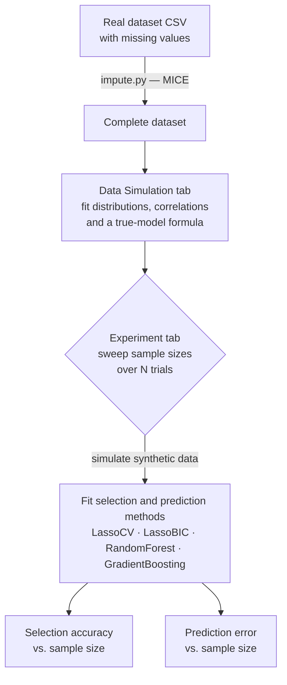

# NASA Simulation Study Tool

**A desktop GUI for running Monte-Carlo simulation studies that answer a practical research question: how many samples do you actually need before a variable-selection method reliably recovers the true predictors?**



Statistical simulation studies are usually one-off scripts. This tool turns the workflow into an interactive app: point it at a real dataset (missing values are first filled in by MICE imputation), let it estimate the variable means, correlations, and a plausible "true" regression model, then sweep across sample sizes and repeat many trials to chart how selection accuracy and prediction error improve as data grows. It was originally built for a NASA research collaboration, with parallel initial work in R.

## Features

- **Missing-data imputation** — `impute.py` fills gaps in a real dataset with MICE (`impyute`), standardizes it, and draws a scatterplot matrix that highlights imputed cells in red so you can eyeball fill quality.
- **Data Simulation tab** — upload a CSV, auto-fit per-variable Normal/Categorical distributions and a correlation matrix (rendered as a heatmap), and fit a human-readable "true model" formula via Lasso, Lasso CV, or Lasso CV + 1 std. dev.
- **Synthetic sampling** — draws correlated samples from a multivariate normal, turns chosen variables categorical via inverse-CDF thresholds, dummy-encodes them, and evaluates the true-model formula to generate the response.
- **Experiment tab** — sweep a range of sample sizes over N trials and compare selection methods (LassoCV, LassoCV + 1σ, LassoBIC, fixed-α Lasso) against predictors (Random Forest, Gradient Boosting).
- **Accuracy & error metrics** — tracks % perfectly-chosen variable sets, predictors missed, false predictors, mean symmetric difference, and prediction MSE, plotted against sample size and parallelized across 8 worker processes.

## Run it

```bash
# Install the scientific-Python + PyQt stack
pip install PyQt5 pyqtgraph scikit-learn pandas numpy scipy matplotlib impyute

# 1. (Optional) Impute missing values in raw data -> mice_real_data.csv
#    Expects real_data.csv in the repo root.
python impute.py

# 2. Launch the GUI.
#    Run from inside simulationgui/ — the app imports its modules by bare name.
cd simulationgui
python app.py
```

Then, in the app: upload your (imputed) CSV on the **Data Simulation** tab, fit distributions and a true model, switch to the **Experiment** tab, pick methods and metrics, and hit **Run Experiment** to plot the curves.

> Note: this targets a ~2018-era stack. The code uses pandas accessors since removed (`.ix`, `DataFrame.append`, `set_value`) and PyQt5 5.10, so it needs pinned legacy versions rather than the latest releases.

## How it works

Given an imputed dataset, the app estimates each variable's distribution and a categorical-aware covariance matrix, then fits a sparse regression to propose a ground-truth model of the form `1.2*x1 + 0.5*x3 + normal(0, σ)`. For each sample size in the sweep it draws fresh synthetic datasets from that model over many trials, refits every selected method, and scores how often each recovers the exact true predictor set and how low its out-of-sample error goes. Averaging across trials turns the per-trial noise into smooth curves, so you can read off the sample size where a method "locks on" to the right variables.

---

Tech: Python (PyQt5, pyqtgraph, scikit-learn, pandas, NumPy, SciPy, Matplotlib, impyute).
Authors: Kyran Adams (Python) and James Warner (initial work in R).
